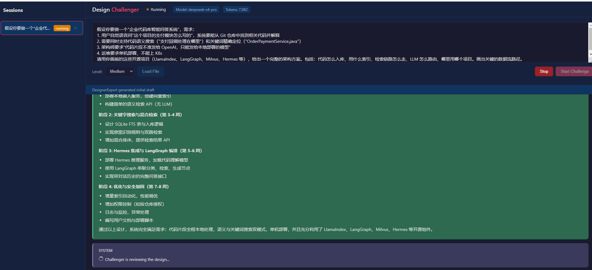

<p align="center">
  <h1 align="center">Design Challenger</h1>
  <p align="center">
    Adversarial AI system that produces high-quality design documents through agent debate
  </p>
</p>

<p align="center">
  
  
  
  
  
</p>

---

## How It Works

Two AI agents debate to perfect your design document:

- **DesignerExpert** — Generates detailed, executable design documents. Responds to criticism and updates the design.
- **Challenger** — Attacks the design from every angle: architecture, security, scalability, edge cases. Relentless at the Strong level.

After the agents reach consensus, **you** get the final say — add your own challenges or sign off.

```
┌─────────────────┐     ┌─────────────────┐
│ DesignerExpert  │◄───►│   Challenger     │
│  Creates design  │     │  Critiques design │
└─────────────────┘     └─────────────────┘
           │                      │
           └──────────┬───────────┘
                      ▼
              ┌──────────────┐
              │  Human Review  │
              │  (final say)   │
               └──────────────┘
```

<p align="center">
  
</p>

## Quick Start

```bash
# 1. Install
pip install -r requirements.txt

# 2. Set your API key (recommended: env var, won't leak into git)
#    Linux/macOS:  export CHALLENGER_API_KEY="sk-your-key"
#    Windows:      $env:CHALLENGER_API_KEY="sk-your-key"
#    Or edit config/llm.yaml and set api_key directly

# 3. Run
python run.py

# 4. Open http://127.0.0.1:8000
```

Paste a requirement like *"Design a real-time chat app for 10k concurrent users"*, pick a challenge level, and watch the agents debate live.

## Features

- **Adversarial design generation** — Two agents challenge and improve each other
- **3 challenge levels** — Weak (gentle), Medium (thorough), Strong (relentless)
- **Human-in-the-loop** — You get final review after AI consensus
- **Real-time SSE streaming** — Watch the debate unfold live
- **RAG knowledge retrieval** — LlamaIndex + Milvus for domain knowledge injection
- **Checkpoint & resume** — LangGraph `SqliteSaver` preserves state; continue interrupted sessions
- **Download artifacts** — Export conversation log + final design doc as Markdown

## Architecture

```
Browser (SSE) ←→ FastAPI ←→ LangGraph StateGraph ←→ LLM API (DeepSeek/OpenAI)
                                │
                                ├── SqliteSaver (checkpoint)
                                ├── SQLite (sessions)
                                └── LlamaIndex + Milvus (RAG)
```

| Component | Technology |
|-----------|------------|
| Agent orchestration | LangGraph `StateGraph` |
| LLM interface | LangChain + `langchain-openai` |
| Web server | FastAPI + uvicorn |
| SSE streaming | `StreamingResponse` text/event-stream |
| Checkpoint persistence | `langgraph-checkpoint-sqlite` |
| Session storage | SQLite via `sqlite3` |
| Vector search | LlamaIndex + Milvus / MilvusLite |

Full architecture details: [`docs/architecture.md`](docs/architecture.md)

## Project Structure

```
design-challenger/
├── agents.md              # AI agent instructions
├── run.py                 # Entry point
├── requirements.txt
├── config/
│   ├── llm.yaml           # LLM configuration
│   └── rag.yaml           # RAG configuration
├── docs/
│   ├── architecture.md    # Architecture deep dive
│   └── usage.md           # Usage guide + API reference
└── src/
    ├── agents.py          # DesignerExpert + Challenger prompts
    ├── graph.py           # LangGraph StateGraph + nodes
    ├── rag.py             # LlamaIndex + Milvus search
    ├── db.py              # SQLite session storage
    ├── main.py            # FastAPI app + SSE endpoints
    └── static/
        └── index.html     # Web UI (vanilla HTML/CSS/JS)
```

## Configuration

**`config/llm.yaml`** — Works with any OpenAI-compatible API.
Set the API key via the `CHALLENGER_API_KEY` environment variable (recommended),
or edit the `api_key` field directly:

```yaml
llm:
  base_url: "https://api.deepseek.com/v1"
  api_key: "${CHALLENGER_API_KEY}"    # env var, or replace with your key
  model: "deepseek-v4-pro"
  temperature: 0.7
```

**`config/rag.yaml`** — MilvusLite (local, zero-setup) or remote Milvus server:

```yaml
rag:
  mode: "milvus_lite"              # or "milvus" for remote
  milvus_lite_db: "data/milvus_lite.db"
```

## Usage Guide

See [`docs/usage.md`](docs/usage.md) for detailed instructions, API reference, and troubleshooting.

## License

MIT
